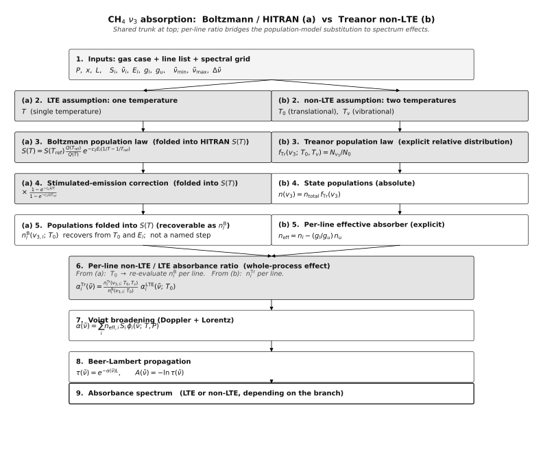
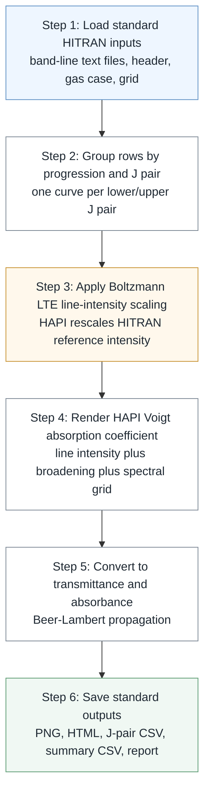

# CH4 nu3 Boltzmann HITRAN process figure

This figure summarizes the traditional local thermodynamic equilibrium (LTE) HITRAN workflow used by:

- [`scripts/plot_hitran_band_text_absorbance_progressions.py`](../scripts/plot_hitran_band_text_absorbance_progressions.py)
- the HITRAN path inside [`scripts/plot_combined_pure_nu3_absorbance_progressions.py`](../scripts/plot_combined_pure_nu3_absorbance_progressions.py)



*Focus the left (amber) column for the LTE/HITRAN path. The right column is the Treanor non-LTE comparison described in [the Treanor figure note](ch4_nu3_treanor_process_figure.md). Source: [`figures/ch4_nu3_process_diagram.py`](figures/ch4_nu3_process_diagram.py).*

Mermaid is kept below as a text-source fallback; it renders cleanly in Obsidian and survives where SVG embeds don't. Formulas are written as Markdown LaTeX because Mermaid node labels do not reliably render LaTeX.



## What this process assumes

The traditional workflow assumes local thermodynamic equilibrium. One temperature controls the state populations:

$$
T
$$

In this path, HITRAN provides reference line intensities, usually at:

$$
T_{\mathrm{ref}}=296\ \mathrm{K}
$$

HAPI rescales each line intensity to the target gas temperature.

## Script-level process

The standard HITRAN path is:

```text
band-line text files
    -> group by vibrational progression and J pair
    -> rescale HITRAN line intensity to target T
    -> render HAPI Voigt absorption coefficient
    -> convert to transmittance and absorbance
    -> save PNG, HTML, J-pair CSV, summary CSV, report.md
```

The input gas and grid settings are:

$$
T,\ P,\ x,\ L,\ \tilde{\nu}_{\min},\ \tilde{\nu}_{\max},\ \Delta\tilde{\nu}
$$

where $T$ is gas temperature, $P$ is pressure, $x$ is CH4 mole fraction, and $L$ is path length.

## Boltzmann intensity scaling

Conceptually, the target-temperature line intensity is:

$$
S(T)
=
S(T_{\mathrm{ref}})
\frac{Q(T_{\mathrm{ref}})}{Q(T)}
\exp\left[-c_2E_l\left(\frac{1}{T}-\frac{1}{T_{\mathrm{ref}}}\right)\right]
\frac{1-\exp(-c_2\tilde{\nu}/T)}
{1-\exp(-c_2\tilde{\nu}/T_{\mathrm{ref}})}
$$

This is where the Boltzmann distribution enters the traditional workflow. The lower-state population is not chosen independently; it is determined by the single temperature $T$.

## Spectrum construction

For each grouped J-pair curve, HAPI computes a Voigt-broadened absorption coefficient:

$$
\alpha(\tilde{\nu})
=
\sum_i S_i(T)\phi_i(\tilde{\nu};T,P)
$$

Then it converts to transmittance:

$$
\tau(\tilde{\nu})
=
\exp[-\alpha(\tilde{\nu})L]
$$

and absorbance:

$$
A(\tilde{\nu})
=
-\ln\tau(\tilde{\nu})
$$

The scripts then save one figure per progression, split into branch panels:

$$
\Delta J=-1,\ 0,\ +1
$$

## Relation to the Treanor process

The Boltzmann/HITRAN path is the baseline:

```text
one temperature T
    -> LTE populations
    -> LTE spectrum
```

The Treanor path changes the population-distribution step:

```text
T0 plus Tv
    -> non-LTE nu3 populations
    -> non-LTE spectrum
```

So the Treanor workflow should be compared against this standard HITRAN/Boltzmann workflow.
