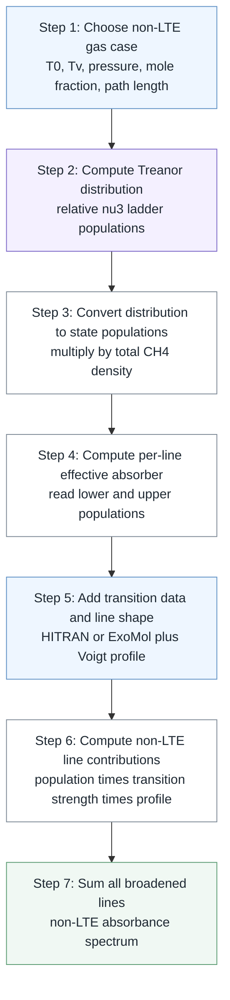

# CH4 nu3 Treanor non-LTE process figure

This figure summarizes the effective CH4 `nu3` Treanor path. The shared diagram below places Treanor (right column) next to the Boltzmann/LTE baseline (left column) so the population-model substitution is visible at a glance.


*Focus the right (violet/white) column for the Treanor non-LTE path. The left column is the LTE baseline described in [the Boltzmann figure note](ch4_nu3_boltzmann_hitran_process_figure.md). Source: [`figures/ch4_nu3_process_diagram.py`](figures/ch4_nu3_process_diagram.py).*

Mermaid is kept below as a text-source fallback; it renders cleanly in Obsidian and survives where SVG embeds don't. Formulas are written as Markdown LaTeX because Mermaid node labels do not reliably render LaTeX.



## How to read it

The Treanor process starts from a non-local thermodynamic equilibrium gas case:

$$
T_0,\ T_v,\ P,\ x,\ L
$$

where:

| Symbol | Meaning |
| --- | --- |
| $T_0$ | translational/gas temperature |
| $T_v$ | effective `nu3` vibrational temperature |
| $P$ | pressure |
| $x$ | CH4 mole fraction |
| $L$ | optical path length |

Treanor gives the effective `nu3` state distribution:

$$
f_{\mathrm{Tr}}(v_3;T_0,T_v)=\frac{N_{v_3}}{N_0}
$$

The gas case gives the total CH4 number density:

$$
n_{\mathrm{total}}=\frac{Px}{k_B T_0}
$$

Together they give state population densities:

$$
n(v_3)=n_{\mathrm{total}}f_{\mathrm{Tr}}(v_3)
$$

For each absorption transition written as:

```text
upper <- lower
```

the effective absorber population is:

$$
n_{\mathrm{eff}}=n_l-\left(\frac{g_l}{g_u}\right)n_u
$$

The line database supplies transition strengths and line positions. A line profile then gives the contribution of each transition:

$$
\sigma_i(\tilde{\nu}) \propto n_{\mathrm{eff},i}S_i\phi_i(\tilde{\nu})
$$

Summing all broadened lines gives the non-LTE absorbance spectrum.

## Main output

The useful output is a non-LTE spectrum at the same gas temperature $T_0$ but with a separate vibrational temperature $T_v$.

The diagnostics are hot-band ratios such as:

$$
\frac{\int A_{2\leftarrow1}(\tilde{\nu})\,d\tilde{\nu}}
{\int A_{1\leftarrow0}(\tilde{\nu})\,d\tilde{\nu}}
$$

and:

$$
\frac{\int A_{3\leftarrow2}(\tilde{\nu})\,d\tilde{\nu}}
{\int A_{1\leftarrow0}(\tilde{\nu})\,d\tilde{\nu}}
$$

These ratios are the bridge from vibrational non-equilibrium to observable spectral signatures.

## Related baseline

For the traditional Boltzmann/HITRAN workflow, see:

[ch4_nu3_boltzmann_hitran_process_figure.md](ch4_nu3_boltzmann_hitran_process_figure.md)
